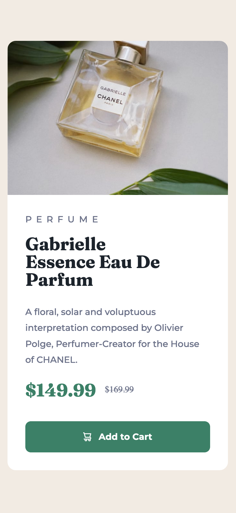

# Frontend Mentor - Product preview card component solution

This is a solution to the [Product preview card component challenge on Frontend Mentor](https://www.frontendmentor.io/challenges/product-preview-card-component-GO7UmttRfa). Frontend Mentor challenges help you improve your coding skills by building realistic projects. 

## Table of contents

- [Overview](#overview)
  - [The challenge](#the-challenge)
  - [Screenshot](#screenshot)
  - [Links](#links)
- [My process](#my-process)
  - [Built with](#built-with)
  - [What I learned](#what-i-learned)
  - [Continued development](#continued-development)
- [Author](#author)

## Overview

### The challenge

Users should be able to:

- View the optimal layout depending on their device's screen size
- See hover and focus states for interactive elements

### Screenshot

### Links

- Solution URL: https://github.com/fvreede/product-preview-card-component-
- Live Site URL: https://product-preview-card-component-gray.vercel.app

## My process

### Built with

- HTML
- CSS
- Flexbox
- CSS Grid

### What I learned

I have learned that it's important to use CSS reset so that the standardized browser layout will be set to 0/null/nil. This way I can take control of my styling, which was fun but it's a really tedious work... I love a good challenge though. 

### Continued development

I will be using flexbox and grid layouts in the future. I'm also thinking about using React, Vue and Angular in my future projects.

## Author

- GitHub - [Fabio Vreede](https://www.github.com/fvreede)
- Frontend Mentor - [@fvreede](https://www.frontendmentor.io/profile/fvreede)
